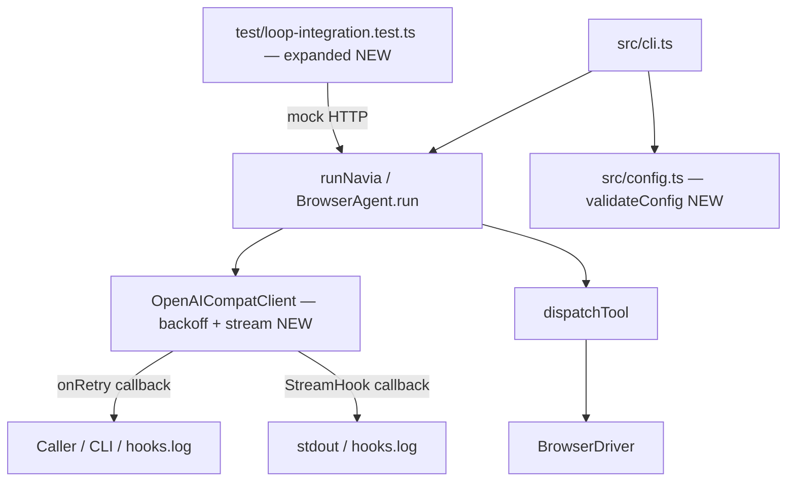

# Design Document — end-to-end-validation-improvements

## Overview

This document describes the technical design for five quality and reliability improvements to the Navia web automation agent. The changes are self-contained and touch four distinct subsystems, but they all share the same goal: make the agent more observable, more testable, and more resilient in production.

**Areas covered:**

1. **Integration test suite expansion** — new `loop-integration.test.ts` scenarios covering error recovery, truncated responses, max-step termination, and loop detection.
2. **Exponential backoff with jitter** — replace the linear `800ms × attempt` sleep in `OpenAICompatClient` with `min(base × 2^attempt + jitter, cap)`.
3. **Config schema validation** — add a `validateConfig(raw)` function to `src/config.ts` that rejects bad types and unknown values before they silently corrupt a run.
4. **CLI response streaming** — consume `/v1/chat/completions` as Server-Sent Events, forwarding `delta.content` chunks to a `StreamHook` callback in real time.
5. **Retry observability** — surface each retry attempt through an optional `onRetry` callback injected into `OpenAICompatClient` at construction time.

---

## Architecture

The five improvements are independent and touch different layers of the stack.



No new public API surfaces or new files are added except the two exported helpers (`validateConfig` in `src/config.ts` and `calcDelay` exported via `__test` in `src/providers/openai-provider.ts`). All five changes are backwards-compatible additions or replacements of existing private logic.

---

## Components and Interfaces

### 1. Integration Test Suite (`test/loop-integration.test.ts`)

The existing file contains one `describe` block with a single test. The new tests join the same `describe` block and reuse the existing `mockLLM`, `toolTurn`, and `textTurn` helpers.

Four new test scenarios are added:

| Scenario | What the mock returns | What is asserted |
|---|---|---|
| Tool error recovery | tool succeed → tool throw → text finish | `metrics.toolErrors >= 1`, `metrics.recoveries === 0` |
| Truncated response (`finish_reason: "length"`) | `finish_reason: "length"` → tool → text | `metrics.toolErrors === 0`, `result.steps >= 2` |
| Max-steps termination | infinite tool calls (mock repeats) | `result.summary` ⊇ max-steps message, `result.steps === maxSteps` |
| Loop-hit detection | identical tool call × 2 | `metrics.loopHits >= 1` (already covered by existing test) |

Each test calls `runNavia` with `provider: "openai"`, `headless: true`, and a `data:text/html,...` start URL. Env setup/teardown is handled in the existing `afterEach`.

A `lengthTurn()` helper is added alongside `toolTurn` and `textTurn`:

```typescript
function lengthTurn(text = "") {
  return {
    choices: [{ message: { content: text }, finish_reason: "length" }],
    usage: { prompt_tokens: 5, completion_tokens: 3 },
  };
}
```

A `failingToolTurn()` helper makes a tool call that `dispatchTool` will fail on (unknown tool name produces an error result in the loop):

```typescript
function failingToolTurn(name: string, args: object, id: string) {
  // dispatchTool returns an is_error result for unknown tool names,
  // which increments metrics.toolErrors without propagating an exception.
  return toolTurn(name, args, id); // use an unrecognised name like "bad_tool"
}
```

### 2. `OpenAICompatClient` — Exponential Backoff with Jitter (`src/providers/openai-provider.ts`)

**Current behaviour:** `await new Promise(r => setTimeout(r, 800 * (attempt + 1)))` — linear, no jitter, same formula for HTTP errors and network exceptions.

**New behaviour:** replace the sleep call with a shared `calcDelay` helper and an optional `sleep` override for testing.

```typescript
/**
 * Returns the delay in ms for a given retry attempt.
 * Formula: min(base * 2^attempt + uniform_jitter(0, 200), cap)
 * Default: base=500ms, cap=30_000ms
 */
export function calcDelay(
  attempt: number,
  base = 500,
  cap = 30_000,
): number {
  const jitter = Math.random() * 200;
  return Math.min(base * Math.pow(2, attempt) + jitter, cap);
}
```

`calcDelay` is exported inside `__test` so unit tests can call it without mocking the timer:

```typescript
export const __test = {
  toOpenAITools,
  toOpenAIMessages,
  fromOpenAIResponse,
  calcDelay,       // NEW
};
```

Inside the retry loop, every `setTimeout` call is replaced with:

```typescript
const waitMs = calcDelay(attempt);
this.onRetry?.(attempt + 1, waitMs, reason);   // observability (Req 5)
await sleep(waitMs);                            // sleep = setTimeout wrapper
```

The `sleep` function defaults to `(ms) => new Promise(r => setTimeout(r, ms))` and is injected via the constructor for test overrides (see Section 5).

### 3. Config Schema Validation (`src/config.ts`)

A new exported function `validateConfig(raw: unknown): NaviaConfig` is added. It is called by `loadConfigSync` before returning, replacing the current `as NaviaConfig` cast.

**Validation rules:**

| Field | Rule |
|---|---|
| `model` | Must be `string` if present; throw otherwise |
| `browser` | Must be one of `{"chromium","chrome","firefox","patchright"}` if present |
| `provider` | Must be one of `{"auto","api","claude-cli","openai"}` if present |
| `workspace` | Must be `boolean` or `string` if present |
| unknown fields | Silently ignored (forward-compatible) |
| root value | Must be a plain object; throw if `null`, array, primitive |
| missing file | Return `{}` (unchanged behaviour) |
| malformed JSON | Throw with file path and "not valid JSON" in message |

```typescript
const VALID_BROWSERS = new Set(["chromium", "chrome", "firefox", "patchright"]);
const VALID_PROVIDERS = new Set(["auto", "api", "claude-cli", "openai"]);

export function validateConfig(raw: unknown): NaviaConfig {
  if (raw === null || typeof raw !== "object" || Array.isArray(raw)) {
    throw new Error(`config.json: root value must be a plain object, got ${Array.isArray(raw) ? "array" : typeof raw}`);
  }
  const obj = raw as Record<string, unknown>;
  const out: NaviaConfig = {};

  if ("model" in obj) {
    if (typeof obj.model !== "string")
      throw new Error(`config.json: field "model" must be a string, got ${typeof obj.model}`);
    out.model = obj.model;
  }
  if ("browser" in obj) {
    if (!VALID_BROWSERS.has(obj.browser as string))
      throw new Error(`config.json: field "browser" has invalid value "${obj.browser}"; expected one of ${[...VALID_BROWSERS].join(", ")}`);
    out.browser = obj.browser as NaviaConfig["browser"];
  }
  if ("provider" in obj) {
    if (!VALID_PROVIDERS.has(obj.provider as string))
      throw new Error(`config.json: field "provider" has invalid value "${obj.provider}"; expected one of ${[...VALID_PROVIDERS].join(", ")}`);
    out.provider = obj.provider as NaviaConfig["provider"];
  }
  if ("workspace" in obj) {
    if (typeof obj.workspace !== "boolean" && typeof obj.workspace !== "string")
      throw new Error(`config.json: field "workspace" must be boolean or string, got ${typeof obj.workspace}`);
    out.workspace = obj.workspace as NaviaConfig["workspace"];
  }
  if ("profile" in obj) {
    if (typeof obj.profile !== "string")
      throw new Error(`config.json: field "profile" must be a string, got ${typeof obj.profile}`);
    out.profile = obj.profile;
  }
  return out;
}
```

`loadConfigSync` is updated:

```typescript
export function loadConfigSync(): NaviaConfig {
  const file = configPath();
  try {
    const text = readFileSync(file, "utf8");
    let raw: unknown;
    try {
      raw = JSON.parse(text);
    } catch {
      throw new Error(`${file}: not valid JSON`);
    }
    return validateConfig(raw);
  } catch (e) {
    if ((e as NodeJS.ErrnoException).code === "ENOENT") return {};
    throw e;
  }
}
```

### 4. CLI Response Streaming (`src/providers/openai-provider.ts`)

#### StreamHook type

```typescript
/** Callback that receives text token fragments in real time. */
export type StreamHook = (chunk: string) => void;
```

#### Constructor injection

`OpenAICompatClient` gains two optional constructor parameters:

```typescript
export class OpenAICompatClient {
  constructor(
    private cfg: OpenAIPresetConfig,
    private streamHook?: StreamHook,  // NEW
    private onRetry?: (attempt: number, waitMs: number, reason: string) => void, // NEW (Req 5)
    /** Injected in tests to avoid real timers */
    private sleep: (ms: number) => Promise<void> = (ms) => new Promise(r => setTimeout(r, ms)),
  ) { ... }
}
```

The public `messages.create(params)` signature is **unchanged**.

#### Streaming flow

When `streamHook` is defined and the preset is `groq` or `openrouter` (or when the caller explicitly opts in), the `create()` method switches to streaming mode:

```
POST /v1/chat/completions  (body includes "stream": true)
  ↓ ReadableStream (SSE)
  for each "data: {...}" line:
    - if choices[0].delta.content is non-empty string → call streamHook(chunk)
    - if choices[0].delta.tool_calls → accumulate function.arguments fragments
  on "[DONE]" → build Anthropic.Message from accumulated text + tool_use blocks
  on stream error → discard partial state, apply Retry_Policy (restart full request)
```

SSE parsing uses the standard line-splitting approach over the `Response.body` `ReadableStream`:

```typescript
private async createStreaming(params: any, url: string, headers: Record<string, string>, body: any): Promise<Anthropic.Message> {
  const res = await fetch(url, { method: "POST", headers, body: JSON.stringify({ ...body, stream: true }) });
  if (!res.ok || !res.body) throw new Error(`HTTP ${res.status}`);

  const reader = res.body.getReader();
  const decoder = new TextDecoder();
  let buf = "";
  let accText = "";
  const toolCallAccum: Map<number, { id: string; name: string; args: string }> = new Map();

  while (true) {
    const { done, value } = await reader.read();
    if (done) break;
    buf += decoder.decode(value, { stream: true });
    const lines = buf.split("\n");
    buf = lines.pop()!;
    for (const line of lines) {
      if (!line.startsWith("data: ")) continue;
      const payload = line.slice(6).trim();
      if (payload === "[DONE]") continue;
      try {
        const chunk = JSON.parse(payload);
        const delta = chunk?.choices?.[0]?.delta;
        if (delta?.content) {
          accText += delta.content;
          this.streamHook!(delta.content);
        }
        for (const tc of delta?.tool_calls ?? []) {
          const idx = tc.index ?? 0;
          if (!toolCallAccum.has(idx)) toolCallAccum.set(idx, { id: tc.id ?? "", name: tc.function?.name ?? "", args: "" });
          const entry = toolCallAccum.get(idx)!;
          if (tc.id) entry.id = tc.id;
          if (tc.function?.name) entry.name = tc.function.name;
          if (tc.function?.arguments) entry.args += tc.function.arguments;
        }
      } catch { /* malformed chunk — skip */ }
    }
  }

  // Build Anthropic.Message from accumulated state
  const blocks: any[] = [];
  if (accText.trim()) blocks.push({ type: "text", text: accText });
  for (const [, tc] of [...toolCallAccum.entries()].sort(([a], [b]) => a - b)) {
    let input: any = {};
    try { input = JSON.parse(tc.args || "{}"); } catch { input = {}; }
    blocks.push({ type: "tool_use", id: tc.id || `call_${blocks.length}`, name: tc.name, input });
  }
  const hadToolCalls = toolCallAccum.size > 0;
  return {
    id: "stream_msg",
    type: "message",
    role: "assistant",
    model: params.model || this.cfg.model,
    content: blocks as any,
    stop_reason: hadToolCalls ? "tool_use" : "end_turn",
    stop_sequence: null,
    usage: { input_tokens: 0, output_tokens: 0, cache_read_input_tokens: 0, cache_creation_input_tokens: 0 } as any,
  } as any;
}
```

The main `create()` method selects streaming vs. non-streaming at the top:

```typescript
const useStream = !!this.streamHook && (this.cfg.label === "Groq" || this.cfg.label === "OpenRouter");
```

#### CLI_Runner wiring (`src/agent/cli-agent.ts`)

No changes are required to `cli-agent.ts` because `runViaCli` delegates to the CLI binary provider, not `OpenAICompatClient`. Streaming is wired at the `BrowserAgent` level for the `openai` provider path.

In `src/agent/agent.ts`, `BrowserAgent` passes `hooks.log` as `StreamHook` when constructing `OpenAICompatClient`:

```typescript
if (this.isOpenAI) {
  this.client = new OpenAICompatClient(
    resolveOpenAIPreset(opts.openaiPreset),
    opts.hooks?.log ? (chunk: string) => opts.hooks!.log!(chunk) : undefined,
    undefined, // onRetry wired separately by caller if needed
  );
}
```

### 5. Retry Observability — `onRetry` Callback (`src/providers/openai-provider.ts`)

`onRetry` is the third optional constructor parameter of `OpenAICompatClient`:

```typescript
onRetry?: (attempt: number, waitMs: number, reason: string) => void
```

- `attempt` is 1-based (first retry = 1, last retry = 3).
- `waitMs` is the value returned by `calcDelay` **before** the sleep.
- `reason` is `"HTTP <status>"` for HTTP 429/5xx, or the exception message for network errors.
- It is called **immediately before** `await sleep(waitMs)`.
- It is independent of `StreamHook` — both can be active simultaneously.

Usage from CLI (the CLI can wire it to `hooks.log` for in-line retry messages):

```typescript
new OpenAICompatClient(
  resolveOpenAIPreset(preset),
  streamHook,
  (attempt, waitMs, reason) => hooks.log?.(`⚠️ Retry ${attempt}/3 (${reason}), waiting ${waitMs}ms`),
)
```

---

## Data Models

### `StreamHook`

```typescript
export type StreamHook = (chunk: string) => void;
```

### `NaviaConfig` (unchanged shape, new validation)

```typescript
export interface NaviaConfig {
  model?: string;
  browser?: BrowserEngine;         // "chromium" | "chrome" | "firefox" | "patchright"
  profile?: string;
  provider?: "auto" | "api" | "claude-cli" | "openai";
  workspace?: boolean | string;
}
```

### `calcDelay` signature

```typescript
function calcDelay(attempt: number, base?: number, cap?: number): number;
// attempt: 0-based (0 = first retry delay, 2 = third retry delay)
// base: default 500ms
// cap: default 30_000ms
// returns: min(base * 2^attempt + uniform(0, 200), cap)
```

### SSE accumulator (internal)

```typescript
interface ToolCallAccum {
  id: string;
  name: string;
  args: string;   // raw fragments concatenated; parsed to JSON at [DONE]
}
```

---

## Correctness Properties

*A property is a characteristic or behavior that should hold true across all valid executions of a system — essentially, a formal statement about what the system should do. Properties serve as the bridge between human-readable specifications and machine-verifiable correctness guarantees.*

### Property 1: calcDelay is bounded by the cap

*For any* attempt in [0, 1, 2] and any base and cap values, `calcDelay(attempt, base, cap)` SHALL return a value no greater than `cap` and no less than `base * 2^attempt`.

**Validates: Requirements 2.1**

---

### Property 2: Non-429 4xx errors cause immediate failure

*For any* HTTP status code in the set {400, 401, 403, 404, 422}, `OpenAICompatClient.create()` SHALL throw immediately after exactly one HTTP request, without sleeping.

**Validates: Requirements 2.5**

---

### Property 3: Error message always includes provider label and base URL

*For any* `OpenAIPresetConfig` with an arbitrary `label` and `baseURL`, when all retries are exhausted, the thrown `Error.message` SHALL contain both `cfg.label` and `cfg.baseURL`.

**Validates: Requirements 2.3**

---

### Property 4: onRetry receives the correct attempt number and HTTP reason

*For any* HTTP status in {429, 500, 502, 503} that triggers retry, `onRetry` SHALL be called with `attempt` equal to the 1-based retry count, a positive `waitMs`, and `reason` equal to `"HTTP <status>"`.

**Validates: Requirements 5.1**

---

### Property 5: validateConfig rejects non-string model values

*For any* value that is not a `string` (numbers, booleans, arrays, objects, null), `validateConfig({ model: value })` SHALL throw an `Error` whose message contains the string `"model"`.

**Validates: Requirements 3.1**

---

### Property 6: validateConfig rejects invalid browser values

*For any* string not in `{"chromium", "chrome", "firefox", "patchright"}`, `validateConfig({ browser: value })` SHALL throw an `Error` whose message contains both `"browser"` and the offending value.

**Validates: Requirements 3.2**

---

### Property 7: validateConfig rejects invalid provider values

*For any* string not in `{"auto", "api", "claude-cli", "openai"}`, `validateConfig({ provider: value })` SHALL throw an `Error` whose message contains `"provider"`.

**Validates: Requirements 3.3**

---

### Property 8: validateConfig rejects non-boolean non-string workspace values

*For any* value that is neither `boolean` nor `string` (numbers, null, arrays, objects), `validateConfig({ workspace: value })` SHALL throw an `Error` whose message contains `"workspace"`.

**Validates: Requirements 3.4**

---

### Property 9: validateConfig strips unknown fields

*For any* plain object that contains a mix of valid and unknown fields, `validateConfig(obj)` SHALL return a `NaviaConfig` that contains only the known fields (`model`, `browser`, `provider`, `workspace`, `profile`) and ignores all other keys.

**Validates: Requirements 3.5**

---

### Property 10: validateConfig rejects non-object root values

*For any* root value that is `null`, an array, a number, a boolean, or a string, `validateConfig(value)` SHALL throw an `Error`.

**Validates: Requirements 3.8**

---

### Property 11: StreamHook is called for every non-empty content chunk

*For any* sequence of SSE delta chunks where `choices[0].delta.content` is a non-empty string, the `StreamHook` SHALL be called exactly once per such chunk, in order, before the `Promise` returned by `create()` resolves.

**Validates: Requirements 4.1**

---

### Property 12: Tool-call argument accumulation is correct for any fragmentation

*For any* valid JSON object `O`, splitting `JSON.stringify(O)` into an arbitrary number of fragments and delivering them as consecutive `delta.tool_calls[0].function.arguments` SSE chunks SHALL result in a `tool_use` block whose `input` deep-equals `O`.

**Validates: Requirements 4.2**

---

### Property 13: max-steps termination is exact for any N

*For any* `maxSteps = N` (N ≥ 1) and an LLM mock that never terminates (returns tool calls indefinitely), `runNavia` SHALL return with `result.steps === N` and `result.summary` containing the max-steps message.

**Validates: Requirements 1.3**

---

## Error Handling

### OpenAICompatClient errors

| Condition | Behaviour |
|---|---|
| HTTP 429 or 5xx, attempt < 3 | Invoke `onRetry`, sleep `calcDelay(attempt)`, retry |
| HTTP 429 or 5xx, attempt = 3 | Throw final error with template message |
| HTTP 4xx (not 429) | Throw immediately, no retry |
| Network exception, attempt < 3 | Invoke `onRetry` (reason = exception message), sleep, retry |
| Network exception, attempt = 3 | Throw final error |
| Stream interrupted mid-SSE | Discard partial accumulation, treat as network error, apply retry policy |
| Malformed SSE chunk | Skip chunk, continue accumulation |
| Tool-call `arguments` invalid JSON at `[DONE]` | Set `input = {}`, do not throw |

### Config validation errors

All validation errors include the field name and the received value or type in a human-readable message. They surface to the caller of `loadConfigSync` (typically the CLI startup). The `ENOENT` case is silently converted to `{}`.

### Integration tests

Tests use `headless: true` and short `maxSteps` (≤ 6) to stay fast. The `afterEach` block always runs `srv?.close()` and `delete process.env.*` regardless of test outcome.

---

## Testing Strategy

### Unit tests

**`test/openai-provider.test.ts`** — extend with:
- `calcDelay` bounds: verify `calcDelay(0)` is in `[500, 700]`, `calcDelay(2)` is in `[2000, 2200]`, any attempt returns ≤ 30 000.
- Retry count: mock that returns 429 four times → exactly 4 fetch calls, error thrown.
- No-retry on 4xx: mock that returns 401 once → exactly 1 fetch call, error thrown immediately.
- Error message template: verify label and baseURL appear in thrown message.
- `onRetry` callback: mock returning 500 → onRetry called with attempt=1, positive waitMs, reason="HTTP 500".
- Non-streaming fallback: no StreamHook → request body does not contain `stream: true`.
- SSE accumulation round-trip: split a JSON string into 3 fragments → tool_use block input equals original object.

**`test/config.test.ts`** (new file):
- `validateConfig` with invalid `model`, `browser`, `provider`, `workspace` types/values.
- `validateConfig` with unknown fields → strips them, returns only known fields.
- `validateConfig` with non-object root (null, array, 42, "string") → throws.
- `loadConfigSync` with missing file → returns `{}`.
- `loadConfigSync` with malformed JSON → throws with path in message.

### Integration tests

**`test/loop-integration.test.ts`** — new `it` blocks inside the existing `describe`:
- Tool error scenario (uses an unknown tool name to trigger `is_error`).
- Truncated response scenario (`finish_reason: "length"`).
- Max-steps scenario (mock always returns a tool call, `maxSteps: 2`).
- Env isolation is enforced by the existing `afterEach`.

### Property-based tests

The project uses **Vitest** (already in `devDependencies`). Property-based testing is added using [fast-check](https://fast-check.dev/), a TypeScript-native PBT library. It does not require additional infrastructure and integrates directly with Vitest's `it` blocks.

Install: `npm install --save-dev fast-check`

Each property test runs a **minimum of 100 iterations** via fast-check's default runner.

Property tests are co-located with their unit test files and tagged with a comment:

```typescript
// Feature: end-to-end-validation-improvements, Property 1: calcDelay is bounded by the cap
```

**Properties to implement:**

| Property | File | fast-check arbitraries |
|---|---|---|
| P1 — calcDelay bounded | `test/openai-provider.test.ts` | `fc.integer({min:0,max:2})`, `fc.integer({min:100,max:1000})`, `fc.integer({min:5000,max:60000})` |
| P2 — non-429 4xx no retry | `test/openai-provider.test.ts` | `fc.constantFrom(400,401,403,404,422)` |
| P3 — error message contains label+URL | `test/openai-provider.test.ts` | `fc.string()`, `fc.string()` (label, baseURL) |
| P4 — onRetry args correct | `test/openai-provider.test.ts` | `fc.constantFrom(429,500,502,503)`, `fc.integer({min:1,max:3})` |
| P5 — validateConfig model | `test/config.test.ts` | `fc.oneof(fc.integer(), fc.boolean(), fc.array(fc.string()), fc.constant(null))` |
| P6 — validateConfig browser | `test/config.test.ts` | `fc.string()` filtered to exclude valid values |
| P7 — validateConfig provider | `test/config.test.ts` | `fc.string()` filtered to exclude valid values |
| P8 — validateConfig workspace | `test/config.test.ts` | `fc.oneof(fc.integer(), fc.constant(null), fc.array(fc.string()))` |
| P9 — validateConfig strips unknowns | `test/config.test.ts` | `fc.dictionary(fc.string(), fc.anything())` merged with valid partial config |
| P10 — validateConfig non-object root | `test/config.test.ts` | `fc.oneof(fc.constant(null), fc.array(fc.anything()), fc.integer(), fc.boolean(), fc.string())` |
| P11 — StreamHook called per chunk | `test/openai-provider.test.ts` | `fc.array(fc.string({minLength:1}), {minLength:1})` |
| P12 — tool-call accumulation round-trip | `test/openai-provider.test.ts` | `fc.object()` + `fc.array(fc.integer({min:1,max:10}))` for split points |
| P13 — max-steps exact | `test/loop-integration.test.ts` | `fc.integer({min:1,max:4})` |
