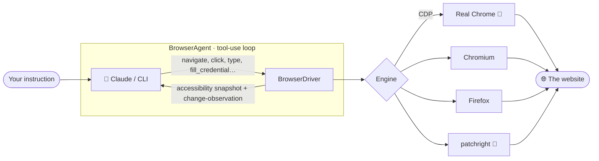
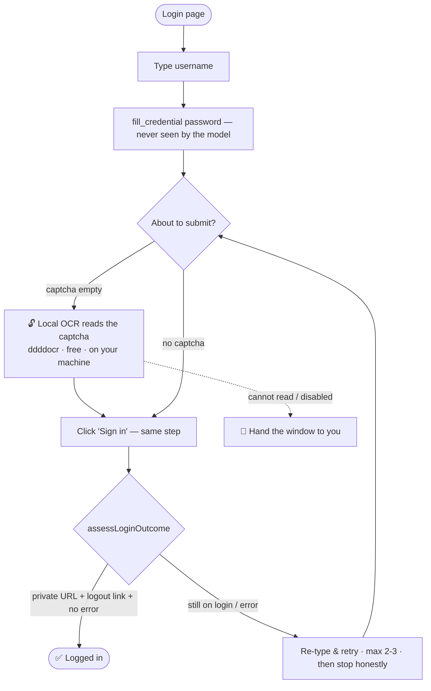

<div align="center">

```
███╗   ██╗ █████╗ ██╗   ██╗██╗ █████╗
████╗  ██║██╔══██╗██║   ██║██║██╔══██╗
██╔██╗ ██║███████║██║   ██║██║███████║
██║╚██╗██║██╔══██║╚██╗ ██╔╝██║██╔══██║
██║ ╚████║██║  ██║ ╚████╔╝ ██║██║  ██║
╚═╝  ╚═══╝╚═╝  ╚═╝  ╚═══╝  ╚═╝╚═╝  ╚═╝
```

# 🌐 Navia

**Automate any repetitive task on any web portal — in plain language.** Fill and submit forms, update records, create entries, download reports, move data between systems, extract tables… Navia opens a **real** browser, logs in (**solving text captchas locally for free**), and does the busywork for you. Just like a person — but tireless.

[](https://www.npmjs.com/package/navia-ai)
[](https://www.npmjs.com/package/navia-ai)
[](https://nodejs.org)
[](LICENSE)
[](https://www.typescriptlang.org/)
[](#-as-an-mcp-server-claude-desktop--code--cursor)
[](https://docs.npmjs.com/generating-provenance-statements)

```bash
npm i -g navia-ai   &&   navia
```

</div>

<!--
  📹 DEMO GIF — graba una corrida (p.ej. con ScreenToGif/Peek), súbela a docs/demo.gif
  y descomenta la línea de abajo. Recomendado: el wizard resolviendo un login con captcha.
-->
<!-- <div align="center"></div> -->

> [!NOTE]
> Works **with** your Anthropic (Claude) API key — or **with no key at all**, using the `claude`/`ant` CLI already signed in on your terminal. No per-site scripts: the AI discovers buttons and fields live.

---

## 📑 Table of contents

- [What can you automate?](#-what-can-you-automate)
- [Why Navia](#-why-navia)
- [Quick start](#-quick-start)
- [How it works](#-how-it-works)
- [The login + captcha flow](#-the-login--captcha-flow)
- [CLI usage](#-cli-usage)
- [Credentials, 2FA & sessions](#-credentials-2fa--sessions)
- [Per-domain memory](#-per-domain-memory-playbooks)
- [No API key? Run it for free](#-no-api-key-run-it-for-free)
- [Deterministic macros](#-deterministic-macros-record--replay-no-ai)
- [Structured extraction](#-structured-extraction-web--typed-json)
- [Library usage](#-library-usage)
- [MCP server](#-as-an-mcp-server-claude-desktop--code--cursor)
- [Engines](#-browser-engines)
- [Responsible use](#-responsible-use)

---

## 💡 What can you automate?

Anything you'd do by hand in a web portal, described in one sentence:

```bash
navia "log into my-portal.com and fill the new-client form with: name Ada Lovelace, email ada@x.com, plan Pro"
navia "update my profile phone number to +52 55 1234 5678 and save"
navia "download every invoice from this quarter into my Downloads folder"
navia "go through the pending tickets and mark as resolved the ones older than 30 days"
navia "register these 20 rows from a CSV as new products" --record macro.jsonl   # then replay daily, free
navia extract "all clients with name, email and status" --url ... --schema clients.json   # web → typed JSON
```

…forms, data entry, updates, bulk actions, downloads, scraping to JSON, moving info between systems — the boring repetitive stuff. The login (and its captcha) is just the first step Navia handles on the way.

## ✨ Why Navia

| | |
|---|---|
| 🧠 **One instruction, not a script** | Describe the task in plain language; Navia discovers the buttons/fields and does the steps. No per-site coding. |
| 📝 **Forms & data entry on autopilot** | Fills inputs, dropdowns, checkboxes, uploads files, submits, and **confirms it worked** — across multi-step flows. |
| 🔁 **Do it once, repeat forever** | Record a flow and `replay` it daily **with no LLM, no API key** (free & fast). Self-heals if the site changes. |
| 🆓 **Runs with no API key** | Use **free AI models** — local (Ollama) or cloud free-tier (Groq, OpenRouter) — via any OpenAI-compatible endpoint, or your `claude`/`ant` CLI. The wizard offers them when you have no key. |
| 🪄 **Zero setup, nothing to remember** | Auto-detects login, **auto-downloads the browser**, **auto-installs the captcha reader**. You just answer the task. |
| 🔓 **Text captchas solved automatically & free** | Local OCR reads "PCF53"-style captchas **on your machine** — no paid service, no API, not the LLM. On by default. |
| 🔐 **Secrets the model never sees** | Encrypted vault for passwords/2FA, **domain-bound** (anti-phishing). Injected locally, outside the prompt. |
| 🛡️ **Anti-Cloudflare built in** | `--browser chrome` connects via CDP to your real Chrome → `navigator.webdriver=false`. Not evasion — it's your own browser. |
| 👁️ **Reads like a human** | Accessibility tree (not pixels), traverses shadow DOM + cross-origin iframes, stable versioned refs. |
| 🎛️ **Four primitives — a dial** | `agent` (autonomous), `observe` (propose), `act` (run one, no LLM), `extract` (typed JSON). |
| 💬 **Conversation mode** | Keeps the browser + session open and takes follow-up commands — do task after task without re-logging in. |
| 📦 **CLI + library + MCP server** | TypeScript/ESM. Use it from the terminal, your code, or inside Claude Desktop/Code/Cursor. |

---

## 🚀 Quick start

```bash
npm i -g navia-ai     # install once → use the `navia` command
navia                 # launches the guided wizard
```

On the **first run** Navia downloads the browser by itself if missing (no manual `playwright install`) and installs the local captcha reader on demand. Optionally, set an API key for **faster** runs (vision + prompt caching); without it, Navia uses the `claude`/`ant` CLI on your terminal:

```bash
ANTHROPIC_API_KEY=sk-ant-...
```

<details>
<summary><b>One-liner without installing</b></summary>

```bash
npx navia-ai "open example.com and tell me what the page is about"
```
</details>

Run `navia doctor` anytime to check your environment.

---

## 🔧 How it works



1. **snapshot** = accessibility tree, one `ref` per element (the AI acts by `ref`).
   - **Chromium/Chrome:** built with **CDP** (`Accessibility.getFullAXTree`) — doesn't mutate the DOM, traverses **shadow DOM** and **iframes** (cross-origin/OOPIF like Turnstile via a dedicated CDP session), `ref`s are **stable** (`backendNodeId`).
   - **Firefox:** JS-injection snapshot as fallback.
   - `ref`s are **versioned** (`v<N>:id`): using a stale ref from an old snapshot is rejected instead of hitting the wrong node.
2. **evaluate** runs JS for bulk extraction or stubborn clicks (gate it off with `--no-eval`). **batch_actions** runs several actions in one tool call.
3. **detectChallenge** recognizes anti-bot walls (Cloudflare/Turnstile/hCaptcha/reCAPTCHA/DataDome).
4. The **system prompt** treats all page content as untrusted **data, never instructions** (prompt-injection spotlighting).

---

## 🔓 The login + captcha flow

Most portal automation starts behind a login. This is the part that usually breaks other tools — Navia makes it **fully automatic, deterministic, no loops** — so it can get to the *actual* task (the form, the update, the report):



- **Text captchas** → solved automatically by **local OCR** before submitting (default `--captcha local`).
- **Empty captcha** → submit is **blocked** (no blind sends, no infinite loops; hard retry cap).
- **Interactive captchas** (reCAPTCHA grid, hCaptcha, sliders) & **2FA** → handed to **you**.
- **Success is verified** — Navia won't claim "logged in" unless it really is.

> The LLM is never asked to "solve" a captcha (Claude declines that by policy). The OCR is a **separate, dedicated, local** tool — for **your own authorized accounts**.

---

## 🖥️ CLI usage

```bash
# Guided wizard (recommended): just run navia
navia
#  → asks the start URL, auto-detects login, asks user + hidden password,
#    the task, the browser, and where to save the journal. Captcha is automatic.
#    Conversational: keeps the session open and asks "what now?". Press ESC to quit.

# Direct task
navia "search 't-shirts' on example-shop.com and list the first 5 with prices"

# Conversation mode for a one-off too (stays open, asks for the next)
navia run "explore this site and map its sections" --chat

# Cloudflare-walled sites → real Chrome via CDP
navia chrome                                          # 1) launch Chrome with debugging
navia run "search jobs on {portal}" --browser chrome  # 2) the task
```

<details>
<summary><b>All the useful flags</b></summary>

```bash
navia "..." --browser firefox|chrome|patchright   # engine (default chromium)
navia "..." --headless                            # no visible window
navia "..." --slow-mo 300                         # go slow (anti rate-limit)
navia "..." --start-url https://...               # open a URL before starting
navia "..." --model claude-opus-4-8               # another model
navia "..." --workspace                           # per-task log/brain folder (asks where)
navia "..." --validate                            # an LLM judge re-checks the result and retries once
navia "..." --captcha off                         # disable local captcha OCR (default: local)
navia "..." --no-eval                             # disable the evaluate JS tool (untrusted sites)
navia "..." --allow-domain example.com            # network allow-list (repeatable, anti-exfiltration)
navia "..." --yes                                 # auto-approve irreversible actions (TEST ONLY)
```
</details>

### Set your defaults once · scaffold a project

```bash
navia init                     # save model/engine/profile/provider to ~/.navia/config.json
navia create my-bot            # scaffold: navia.config.json, .env.example, tasks.txt, run.mjs
```
Precedence: **CLI flag > env var > `~/.navia/config.json` > built-in default.**

---

## 🔐 Credentials, 2FA & sessions

Store passwords / 2FA in an **encrypted vault**; the AI **uses** them by key but **never sees the value**:

```bash
navia secret set shop.password                                   # prompts, hidden
navia secret set shop.password --origin https://accounts.x.com   # bind it: only fills on this origin
navia secret totp shop.2fa                                       # TOTP base32 from your authenticator
navia secret list                                                # keys only, no values
```

In a task the AI uses `fill_credential(ref, "shop.password")` / `fill_totp(ref, "shop.2fa")` — the real value is injected locally, **outside the prompt**.

- 🔒 **Encrypted by default** (AES-256-GCM, auto-key at `~/.navia/key`). Set **`NAVIA_SECRET`** for your own passphrase (key never touches disk).
- 🎯 **Domain binding (anti-phishing):** with `--origin`, the secret fills **only** when the element's real frame origin matches — typing your password into an unexpected/cross-origin frame is hard-rejected.

<details>
<summary><b>Sessions / profiles — don't log in every time</b></summary>

```bash
navia login my-portal --start-url https://my-portal.com/login   # sign in once, save the profile
navia run "download my latest invoice" --profile my-portal      # reuse it, already authenticated
```
Profiles live in `~/.navia/profiles/` (gitignored), encrypted.
</details>

---

## 🧠 Per-domain memory (playbooks)

Navia learns reusable "operating tips" per site and re-injects them next time it visits — so it stops rediscovering each site from scratch.

```bash
navia playbook add example.com --note "the 'Sign in' button enables only after re-typing the email"
navia playbook show example.com
navia playbook list
```
Tips are also captured automatically from your `wait_for_human` notes. Disable with `--no-memory`. Stored in `~/.navia/playbooks/`.

---

## 🆓 No API key? Run it for free

Navia works **without an Anthropic key**. The wizard auto-detects what you have; you have three free routes:

### A) Free AI models — local or cloud (`--provider openai`)
Any **OpenAI-compatible** endpoint works (most free models expose one), via presets:

```bash
# Local, private, unlimited — needs Ollama + a model
ollama pull qwen3:14b
navia "log into my-portal.com and update my phone number" --provider openai --openai-preset ollama

# Cloud, fast, free API key (no card) → console.groq.com/keys
setx GROQ_API_KEY gsk_...        # (PowerShell: $env:GROQ_API_KEY="gsk_...")
navia "..." --provider openai --openai-preset groq        # model: qwen3-32b

# OpenRouter (many :free models) — get a key at openrouter.ai
navia "..." --provider openai --openai-preset openrouter

# Any other OpenAI-compatible endpoint (DeepSeek, Together, vLLM, LM Studio…):
#   NAVIA_OPENAI_BASE_URL, NAVIA_OPENAI_API_KEY, NAVIA_OPENAI_MODEL
```

**Recommended free models (2026):** `qwen3-32b` via **Groq** (cloud, no card, strong tool-use) or **Ollama** `qwen3:14b`/`qwen3:32b` (local, private). Qwen3 is Apache-2.0 with the most reliable open tool-calling on consumer hardware. Vision is off on this route (the local captcha OCR still works). Note: free open models are less reliable than Claude on long multi-step loops — expect more retries.

### B) Your terminal's AI CLI (uses your Claude subscription)
```bash
navia run "..." --provider claude-cli --cli-command ant   # `ant` (recommended) or `claude`
```
- **`auto`** (default): Anthropic API key if present; otherwise the `claude` CLI.
- Any other terminal AI: `NAVIA_CLI_CMD="my-cli --flags"`.

> CLI mode spawns one process per step → slower than `--provider api`, but needs no key. With the `claude`/`ant` CLI, Navia can also pass the captcha image to it for tasks that need vision.

---

## 🔁 Deterministic macros (record & replay, no AI)

Record once, replay forever **with no LLM and no API key** — fast and free. Replay uses **stable locators** (role + name) and **self-heals** if the site drifts:

```bash
navia "sign in and download this month's invoice" --record ./invoice.jsonl
navia replay ./invoice.jsonl --profile my-portal
```
Secrets aren't stored in the macro: `fill_credential`/`fill_totp` are re-injected fresh from the vault each replay.

---

## 🧱 Structured extraction (web → typed JSON)

Get schema-validated data: Navia forces the model to answer through a tool whose schema **is** your schema (with retry). Requires an API key.

```bash
navia extract "the first 5 products with name and price" --url https://example-shop.com --schema ./schema.json
```

<details>
<summary><b>Library example</b></summary>

```ts
import { extract } from "navia-ai";

const data = await extract({
  url: "https://news.example.com",
  instruction: "the top 5 headlines with title and points",
  schema: {
    type: "object",
    properties: {
      items: { type: "array", items: { type: "object",
        properties: { title: { type: "string" }, points: { type: "number" } }, required: ["title"] } },
    },
    required: ["items"],
  },
});
```
</details>

### 📊 Reliability & evals

Every run reports metrics beyond pass/fail (steps, tokens, recoveries, repeated-action loops). Benchmark on live-site tasks with an LLM judge:

```bash
navia eval --dataset ./tasks.jsonl --report ./report.json   # Online-Mind2Web-ish; ships a sample set
```

---

## 🧑‍💻 Library usage

```ts
import { runNavia } from "navia-ai";

const { summary, steps, metrics } = await runNavia({
  task: "Open example.com and extract all the main-menu links",
  browser: "chromium",
  validate: true,
  hooks: { log: (m) => console.log(m) },
});

console.log(summary, metrics); // steps, toolCalls, toolErrors, tokensIn/Out, recoveries, loopHits
```

<details>
<summary><b>Primitives: <code>observe</code> / <code>act</code> (the dial)</b></summary>

See candidate actions without running them, then run exactly one — by `ref`, with **no extra LLM call**.

```ts
import { BrowserDriver, observe, act } from "navia-ai";

const driver = await BrowserDriver.create({ engine: "chromium" });
await driver.navigate("https://example.com");

const actions = await observe({ instruction: "the 'More information' link", driver });
await act(actions[0], { driver });          // deterministic, no LLM
// or one-shot:  await act("click 'More information'", { driver });
```
</details>

---

## 🔌 As an MCP server (Claude Desktop / Code / Cursor)

Navia exposes its browser tools as an **MCP server** — the client's model drives them (CDP snapshot, stable refs, captcha detection, profiles, vault).

**Claude Code:**
```bash
claude mcp add navia -- npx -y navia-ai mcp --browser chromium
```

**Claude Desktop / Cursor** (JSON):
```json
{ "mcpServers": { "navia": { "command": "npx", "args": ["-y", "navia-ai", "mcp", "--browser", "chromium"] } } }
```

🔐 **Secure credential elicitation:** if a task needs a vault secret that isn't stored, the server **asks you through your client's secure prompt** (MCP elicitation) and saves it encrypted — never through the model.

---

## 🧭 Browser engines

| Engine | When to use it |
|---|---|
| `chromium` *(default)* | Most sites. |
| `firefox` | Alternative; some portals behave better. |
| `chrome` (CDP) | 🔑 **Cloudflare**-walled sites. Launches your real Chrome and connects via CDP. |
| `patchright` | 🥷 Anti-detection without pre-opening Chrome (removes the `Runtime.enable` leak). Opt-in: `npm i patchright`. |

---

## ⚠️ Responsible use

Navia drives a real browser with **your** credentials and session. Use it only on sites and accounts **you own or are authorized to access**, respecting their Terms of Service. The CDP mode **does not forcibly bypass** protections — it uses your real browser. Navia bundles **no third-party (paid) captcha-solving services**; the local OCR is a dedicated tool for **your own** authorized login, and interactive/behavioral captchas + 2FA are always handed to you.

---

<div align="center">

**[npm](https://www.npmjs.com/package/navia-ai)** · **[Issues](https://github.com/azulls1/navia/issues)** · MIT License

Made with ❤️ for people tired of doing the same portal busywork every day.

</div>
